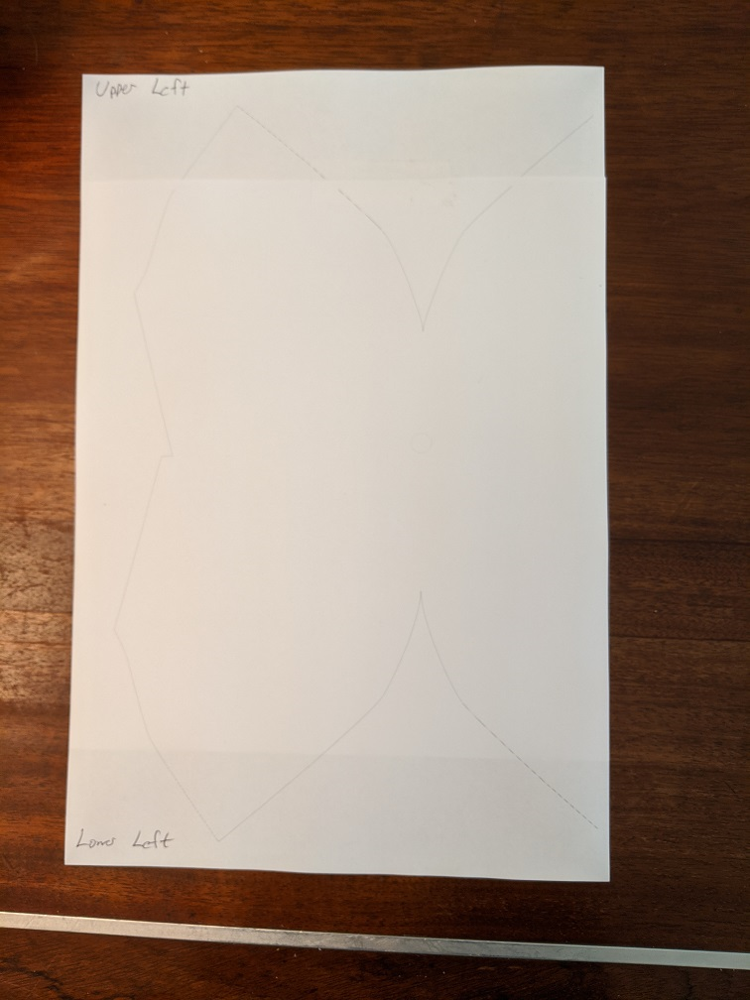
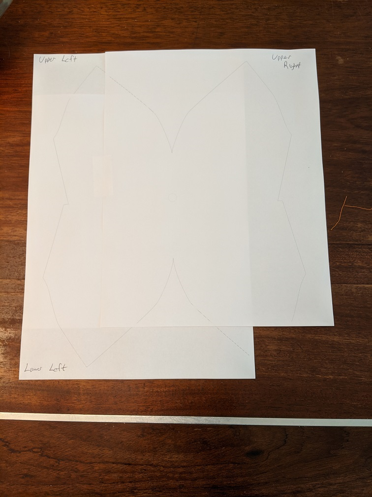
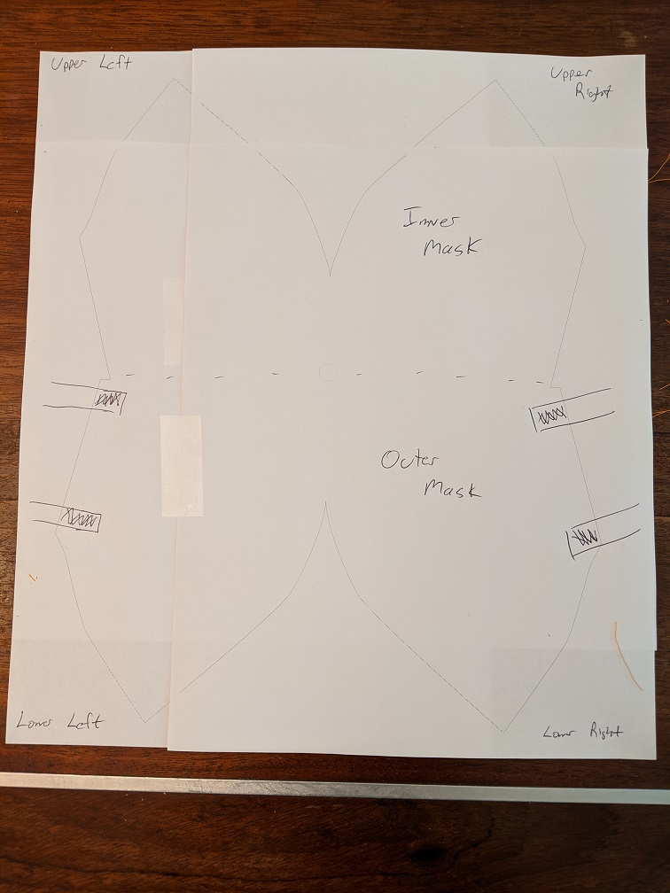

Instructions here for printing 4 pages of 8.5 x 11 paper to make a template.

The mask pattern is too big to fit on on a sheet of printer paper, unless you are heading out to Kinkos. Not such a good idea, as their pandemic hours may have changed.

Print the 4 PDFs (one for each corner), and then tape them all together. Then cut out the mask pattern. 

The straps are simply 1/2" wide by 12" long strips. You can use ribbon, t-shirt material, or whatever you have handy. The t-shirt material tends to work really well - A little bit of stretch is nice. Plus, then you're sewing material to like material and you don't have to worry about some mismatch in material strength.